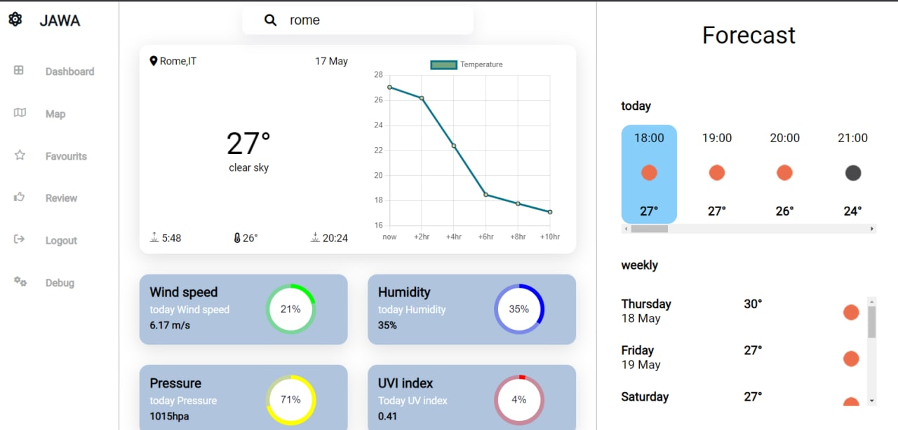
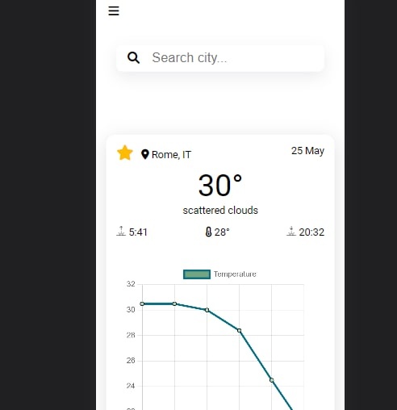
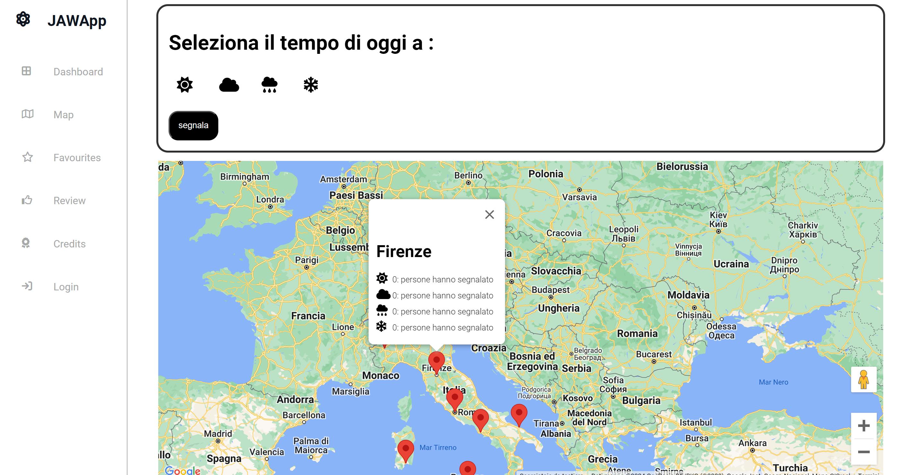
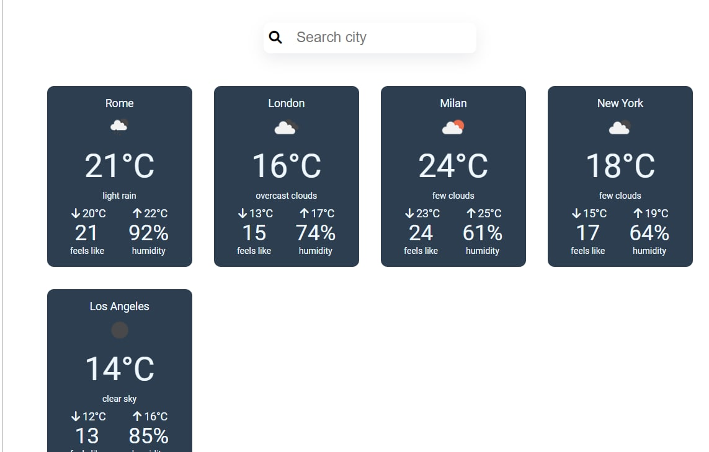
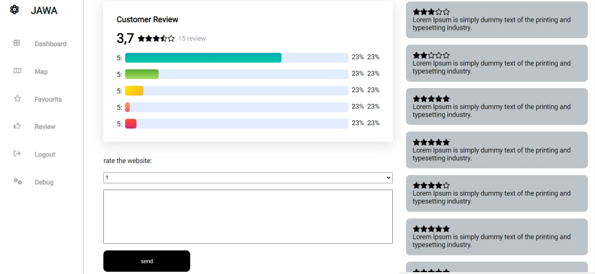
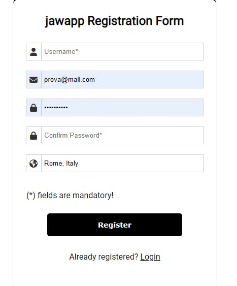

# Frontend Project

## Overview

This repository contains the frontend part of our project. We utilized the following technologies: HTML, CSS, JavaScript, and Vue.js. All components are created with HTML, CSS, and JavaScript, except for the map and temperature chart, which are built using external libraries. We chose to use Vue's Single File Components (SFC) to define the structure, style, and behavior of a component in a single `.vue` file, making each component independent from the rest of the application and easily reusable by simply declaring it in a view.

## Project Structure

The project is organized into the following folders:

- **public**
  - `img/memoji`: Contains images for the credits page.
- **src**: The main folder of the project.
  - **components**: Contains components used in the views.
  - **router**: Contains a single file that manages the views associated with routes.
  - **store**: Contains a single file used to store the local state of the application.
  - **views**: Contains the views of the website.

## Preview

### Dashboard on desktop



### Dashboard on cellphone



### Map



### Favourites



### Reviews



### Form



## Project setup

```
npm install
```

### Compiles and hot-reloads for development

```
npm run serve
```

### Compiles and minifies for production

```
npm run build
```

### Lints and fixes files

```
npm run lint
```

### Customize configuration

See [Configuration Reference](https://cli.vuejs.org/config/).
